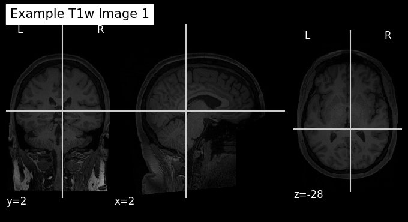
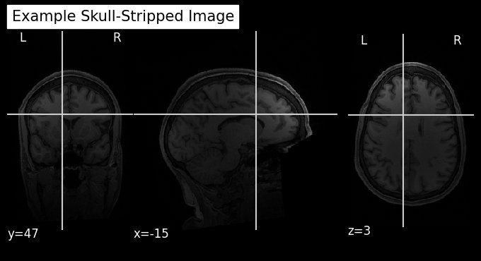
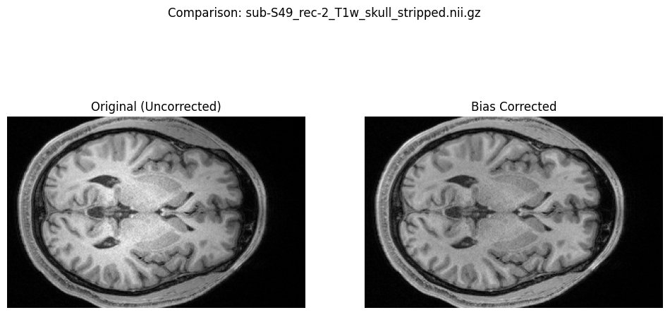
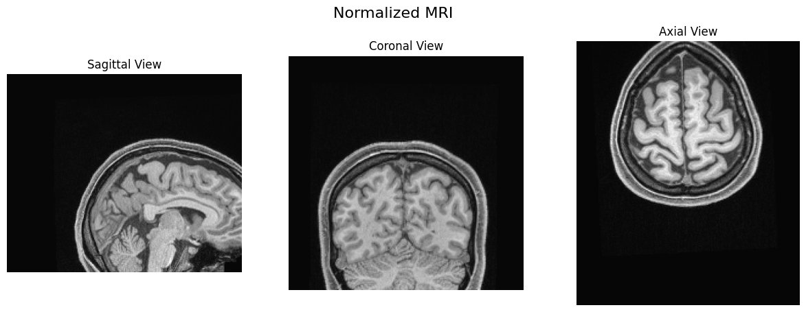
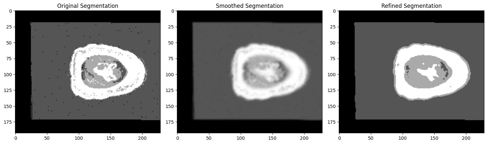
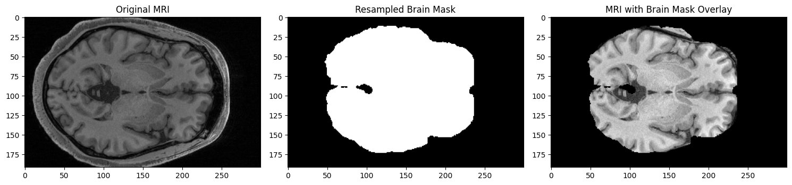

# Bipolar Disorder MRI Analysis Pipeline

A neuroimaging pipeline for processing and analyzing structural T1-weighted MRI data from subjects with bipolar disorder. The project uses the [OpenNeuro dataset ds005073](https://github.com/OpenNeuroDatasets/ds005073) and extracts brain tissue features (gray matter, white matter, and CSF volumes) as a basis for downstream analysis or classification.

---

## Table of Contents

- [Overview](#overview)
- [Dataset](#dataset)
- [Pipeline Steps](#pipeline-steps)
- [Requirements](#requirements)
- [Setup & Usage](#setup--usage)
- [Project Structure](#project-structure)
- [Output Files](#output-files)
- [Known Issues & Notes](#known-issues--notes)

---

## Overview

This project was originally developed as a Google Colab notebook and exported to Python. The pipeline takes raw T1w NIfTI MRI files, preprocesses them through a series of neuroimaging steps, and extracts volumetric features per subject for further analysis.

The subjects in the dataset follow a BIDS-like naming convention:
- `sub-B##` — Bipolar disorder subjects
- `sub-S##` — Control subjects

Only `rec-1` acquisitions are used; `rec-2` scans are skipped throughout the pipeline.

---

## Dataset

**Source:** [OpenNeuro ds005073](https://github.com/OpenNeuroDatasets/ds005073)

The dataset uses [git-annex](https://git-annex.branchable.com/) for large file management. Files must be fetched after cloning:

```bash
sudo apt-get install git-annex
git clone https://github.com/OpenNeuroDatasets/ds005073.git
cd ds005073
git annex init
git annex get .
```

---

## Pipeline Steps

### Step 0 — Data Loading
Clones the dataset from OpenNeuro via git-annex, collects all `_T1w.nii.gz` files, and validates file sizes.

### Step 1.1 — Quality Check
Loads T1w images and visualizes a sample before preprocessing begins.



*Coronal, sagittal, and axial views of a raw T1w scan before any preprocessing. Non-brain tissue (skull, neck) is still present.*

---

### Step 1.2 — Skull Stripping
Uses `nilearn`'s `crop_img` to remove non-brain tissue. Outputs saved to `Preprocessed_T1w_Nilearn/`.



*After skull stripping — the skull and surrounding tissue have been removed, leaving only the brain volume.*

---

### Step 1.3 — Bias Field Correction
Applies N4 bias field correction using `ANTsPy`. Corrects for MRI intensity inhomogeneity (signal drift across the image). Outputs saved to `BiasCorrected_T1w/`.

| Subject A | Subject B | Subject C |
|---|---|---|
|  |  |  |

*Axial slices of three subjects after N4 bias field correction. Intensity across the brain is more uniform.*



*Side-by-side comparison of the same subject before and after N4 bias field correction. Note the improved intensity uniformity across cortical regions.*

---

### Step 1.4 — Spatial Normalization
Registers all images to MNI152 standard space using affine transformation. This aligns all subjects into a common coordinate system for group-level comparisons. Outputs saved to `Normalized_T1w/`.


*The MNI152 T1-weighted template used as the registration target.*



*A subject MRI after registration to MNI152 space, shown in sagittal, coronal, and axial views.*

---

### Step 1.5 — Brain Mask Generation & Tissue Segmentation
Uses FSL's `BET` for brain mask extraction and `FAST` for tissue segmentation into gray matter (GM), white matter (WM), and CSF.


*Gray matter probability map in sagittal, coronal, and axial views after FSL FAST segmentation.*

---

### Step 1.55 — Smoothing & Mask Refinement
Applies Gaussian smoothing (`σ=1`) and morphological operations (erosion/dilation) to clean up segmentation boundaries.



*Left: original segmentation with scattered noise voxels. Center: after Gaussian smoothing. Right: refined segmentation after re-thresholding — tissue boundaries are cleaner.*

---

### Step 1.6 — Feature Extraction
Computes per-subject volumetric features (GM, WM, CSF volumes in cm³) by applying resampled brain masks to constrain calculations to brain tissue only. Results saved to CSV.

**Segmentation visualization (subject sub-B06):**


*Sagittal, coronal, and axial views of the tissue segmentation for subject sub-B06 (bipolar).*


*Left: raw MRI axial slice. Right: tissue segmentation overlaid on the MRI — colored regions correspond to different tissue classes.*


*Three-plane view of the tissue label map (GM=light, WM=white, CSF=dark) across sagittal, coronal, and axial planes.*



*Left: original bias-corrected MRI. Center: binary brain mask generated by FSL BET. Right: brain mask applied to the MRI, isolating the brain region used for volume computation.*

---

## Requirements

The pipeline was developed and run on **Google Colab**. Key dependencies:

| Package | Purpose |
|---|---|
| `nibabel` | NIfTI file I/O |
| `nilearn` | Neuroimaging utilities, resampling, plotting |
| `antspyx` | N4 bias field correction |
| `scipy` | Affine transforms, morphological operations |
| `matplotlib` | Visualization |
| `pandas` | Feature table I/O |
| `numpy` | Array operations |
| FSL (`bet`, `fast`) | Brain extraction, tissue segmentation |
| `git-annex` | Large file retrieval from OpenNeuro |

Install Python dependencies:

```bash
pip install nibabel nilearn antspyx matplotlib pandas numpy
```

FSL must be installed separately. On Ubuntu/Colab:

```bash
wget https://fsl.fmrib.ox.ac.uk/fsldownloads/fslinstaller.py
python3 fslinstaller.py --dest=/usr/local/fsl
export FSLDIR=/usr/local/fsl
export PATH=$FSLDIR/bin:$PATH
. $FSLDIR/etc/fslconf/fsl.sh
```

---

## Setup & Usage

> **Note:** This script was exported from a Google Colab notebook. Google Drive paths (`/content/drive/MyDrive/...`) are hardcoded throughout. Update all path variables to your local equivalents before running outside of Colab.

### On Google Colab

1. Open `final_project.py` in Colab or convert it back to a notebook:
   ```bash
   pip install jupytext
   jupytext --to notebook final_project.py
   ```
2. Mount Google Drive when prompted.
3. Run cells sequentially from Step 0 onward.

### Running Locally

1. Update all `/content/drive/MyDrive/...` paths to local directories.
2. Ensure FSL is installed and `FSLDIR` is set.
3. Run:
   ```bash
   python final_project.py
   ```

---

## Project Structure

```
bipolar-mri-pipeline/
├── final_project.py               # Main pipeline script
├── README.md
├── .gitignore
└── results_figures/               # Pipeline output visualizations
    ├── step01_quality_check_T1w.png
    ├── step02_skull_stripped.png
    ├── step03a_bias_corrected_sub-A00034214.png
    ├── step03b_bias_corrected_sub-A00033749.png
    ├── step03c_bias_corrected_sub-A00033648.png
    ├── step03d_bias_correction_comparison.png
    ├── step04a_mni152_template.png
    ├── step04b_normalized_mri_3views.png
    ├── step05_gray_matter_segmentation.png
    ├── step06_smoothing_refinement.png
    ├── step07_segmentation_3views_sub-B06.png
    ├── step08_segmentation_overlay.png
    ├── step09_tissue_labels_3views.png
    └── step10_brain_mask_overlay.png

Generated data folders (not tracked by git — see .gitignore):
    Preprocessed_T1w_Nilearn/      # Skull-stripped images
    BiasCorrected_T1w/             # N4-corrected images
    Normalized_T1w/                # MNI-space registered images
    Brain_Masks/                   # FSL BET binary masks
    Resampled_Brain_Masks/         # Masks resampled to segmentation space
    Segmented_T1w/                 # FSL FAST segmentation outputs
    Masked_MRIs/                   # Brain-masked MRI volumes
    Resampled_Segmented_T1w/       # Segmentations resampled to MRI space
    Overlay_Results/               # MRI + brain mask overlay volumes
```

---

## Output Files

The primary output is a CSV file with per-subject volumetric features:

| Column | Description |
|---|---|
| `Subject` | Subject ID (e.g., `sub-B06`) |
| `GM_Volume_cm3` | Gray matter volume in cm³ |
| `WM_Volume_cm3` | White matter volume in cm³ |
| `CSF_Volume_cm3` | CSF volume in cm³ |

---

## Known Issues & Notes

- **Hardcoded paths:** All directory paths reference Google Drive and must be updated for local or HPC use.
- **Colab-only cells:** Several cells use `google.colab` imports (`drive.mount`, `output.enable_custom_widget_manager`) which will fail outside of Colab.
- **Shell commands:** Lines beginning with `!` are Jupyter/Colab magic commands. Wrap them in `subprocess.run(...)` to run as a plain Python script.
- **`rec-2` exclusion:** Only `rec-1` acquisitions are processed throughout the pipeline.
- **Voxel volume assumption:** In some feature extraction sections, `voxel_volume` is hardcoded to `1.0 mm³`. Verify this matches your actual data before trusting volume outputs.
- **FSL dependency:** Segmentation and brain extraction require a working FSL installation which is not pip-installable.
